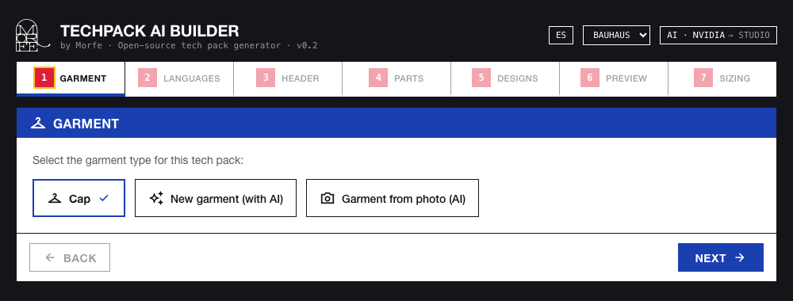
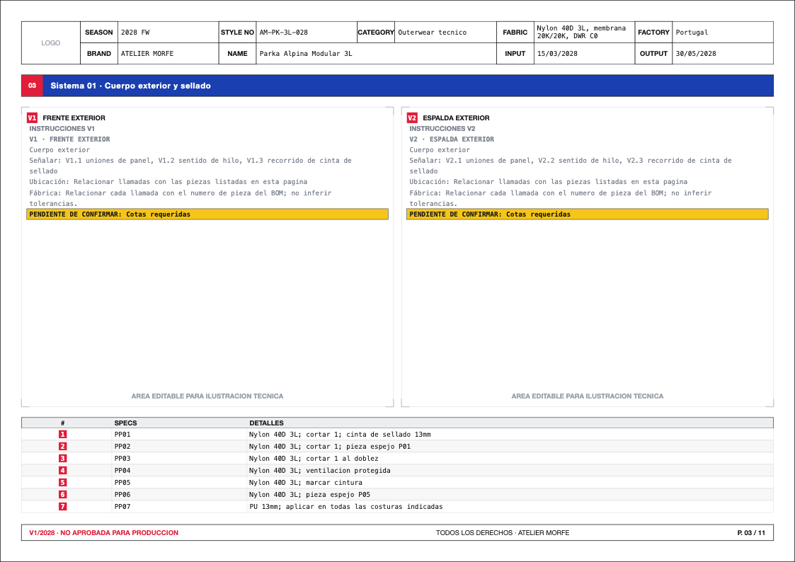
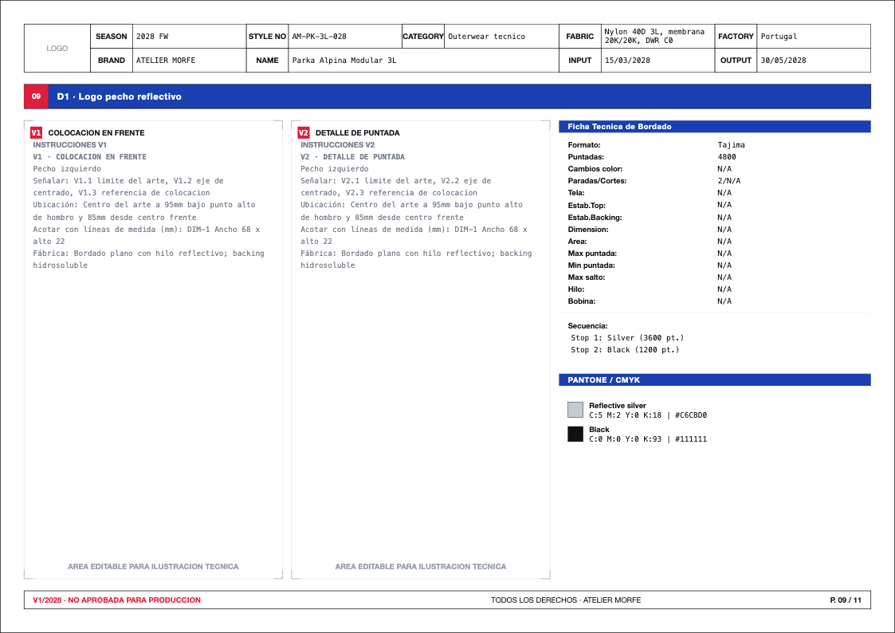
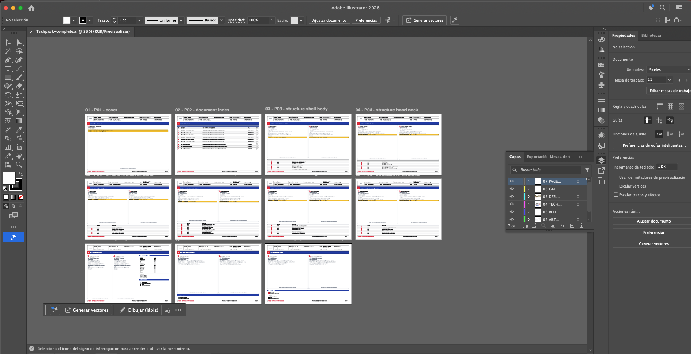

<p align="center"></p>

<p align="center">
  <a href="https://morfemartin.github.io/techpack-ai-builder/"><b>Live demo</b></a> ·
  <a href="#features">Features</a> ·
  <a href="#getting-started">Getting started</a> ·
  <a href="#multi-garment-architecture">Architecture</a> ·
  <a href="ROADMAP.md">Roadmap</a>
</p>

Open-source wizard that generates professional, print-ready fashion **tech packs** as SVG, with no design software required. Built by [Morfe](https://github.com/morfemartin), a branding and textile-development studio, to run its own production pipeline in the open.

> Turn a brand's parts list, colorways and embroidery specs into a multi-page, artboard-ready technical sheet in minutes, in Spanish, English and/or Chinese.

<p align="center"></p>

> **About the live demo:** it is a static build served from GitHub Pages, so the AI-assisted features (CSV import, translation, embroidery-PDF extraction, garment from photo) are disabled there. They need the server-side proxy described under [Security](#security). Run `npm run dev` locally to try them.

---

## Why

Every clothing brand that produces in a factory needs a tech pack for each style: part specifications, a four-view technical drawing, placement and technique for every print or embroidery, exact Pantone/CMYK colors and, when there is embroidery, the machine sheet (stitches, threads, stop sequence).

This is usually assembled by hand in Illustrator, one sheet at a time. TechPack AI Builder generates it from a guided wizard: you enter the data once and get SVG pages that open in Illustrator with one artboard per page.

It is built for two audiences at once:

- **Brands and agencies** that need tech packs fast, in several languages.
- **Developers** who want a solid base for generating technical documents as SVG and extending it to other verticals.

## Features

- **Guided wizard**: garment → export languages → brand header → parts / specs → designs → preview → sizing.
- **Four-view technical diagram** (front / back / left / right) with numbered callouts pointing at each part.
- **Color editor** with Pantone name + hex and automatic CMYK conversion.
- **Dedicated embroidery sheet**, with automatic data extraction from a Wilcom machine PDF (AI-assisted, optional).
- **Multi-language export** (ES / EN / ZH) with AI-assisted translation (optional).
- **Print-first output**: every page is an A4 landscape SVG (`297 × 210 mm`), downloadable or copyable, semantically grouped to open as separate Illustrator artboards.
- **Illustration Handoff**: when technical drawings are missing, the output says so explicitly, with an index, numbered pages, editable artboards and textile instructions, so a designer can finish the illustrations without inventing construction.
- **Multi-garment by design**: adding a new garment type is a data file, not a rewrite. See [below](#multi-garment-architecture).

<table>
  <tr>
    <td></td>
    <td></td>
  </tr>
  <tr>
    <td align="center"><sub>Structure page: views, instructions and numbered parts table</sub></td>
    <td align="center"><sub>Design page with the embroidery machine sheet and Pantone / CMYK colors</sub></td>
  </tr>
</table>

## Getting started

Requirements: Node.js 18+.

```bash
git clone https://github.com/morfemartin/techpack-ai-builder.git
cd techpack-ai-builder
npm install
npm run dev
```

Open `http://localhost:3000`.

Optional: for the AI-assisted features, copy `.env.example` to `.env.local` and add your NVIDIA API key (DeepSeek through NVIDIA's OpenAI-compatible API). The key is read only by the server-side proxy; everything else works without it.

```bash
npm test          # Vitest suite
npm run build     # production build
```

### Quick use

1. Choose the garment type (Cap is fully supported; more on the [roadmap](#roadmap)), or start a new garment with AI or from a photo.
2. Choose the export languages (ES / EN / ZH).
3. Fill in brand, season, style code and factory.
4. Enable and edit the construction parts (fabric, closure, panels…).
5. Add one or more designs: placement, technique, colors, reference image and, if needed, the embroidery sheet.
6. In the preview, generate the SVG for each language and copy or download every page.

## Illustrator compatibility

The plain SVG remains available as an open vector format. To keep a native layer hierarchy and stable names in Illustrator, the project also maintains an export contract and an auditable JSX importer. Format research, AI / PDF / SVG limitations, a controlled test and the integration plan are in **[docs/ILLUSTRATOR-COMPATIBILITY.md](docs/ILLUSTRATOR-COMPATIBILITY.md)**.

Generate the reproducible sample with:

```bash
npm run illustrator:sample
```

From the export modal you can also download a complete package: the included JSX builds a single AI file with every page as a named artboard and seven global semantic layers. Affinity opens the included editable SVGs directly.

<p align="center"></p>

## Private studio AI

The Morfe installation can run **Qwen locally** (through MLX on the Mac) for chat, reasoning and planning, keeping NVIDIA only for vision. The model never ships to GitHub Pages and no key is exposed to the browser.

```bash
uv tool install mlx-lm
npm run studio:ai
```

Then open `http://localhost:3000/studio.html`. The published studio entry point is [morfemartin.github.io/techpack-ai-builder/studio.html](https://morfemartin.github.io/techpack-ai-builder/studio.html): it enables Qwen only when the private bridge is running on the Mac. Configuration, limits and threat model: **[docs/STUDIO-AI.md](docs/STUDIO-AI.md)**.

## Multi-garment architecture

Everything specific to a garment (default parts, part names in three languages, available design placements, and the four-view silhouette with its callouts) lives in a single file under `src/garments/`. The wizard, SVG generation and preview engines are generic and read from that file: nothing is hard-coded to "cap" outside `src/garments/cap.js`.

```
src/
├─ core/         # SVG primitives, base i18n, color utilities, AI clients
├─ garments/     # one data file per garment type + registry
│  ├─ cap.js     # first fully supported garment
│  └─ index.js
├─ components/   # wizard UI (color editor, image uploader, embroidery sheet, SVG modal, preview)
├─ layout/       # flexbox-style layout engine for the generated pages
├─ pages/        # SVG page generators (independent of React)
└─ App.jsx       # the wizard that wires it all together
```

Adding a garment = copy `cap.js`, fill in the same fields and register it. See [CONTRIBUTING.md](CONTRIBUTING.md).

## Design and UX

The interface follows a **Bauhaus** design system in which color encodes attention priority (red = numeric indexes, blue = priority blocks, yellow = critical highlights). It is designed for the real reader of a tech pack, **the factory**, which prints it, photocopies it in black and white and reads it in another language. Everything is encoded in a single `tokens.js` that feeds both the interface and the generated SVG.

The reasoning behind each decision (printing, grayscale, mono type for data, the grid tied to the flexbox engine) is in **[docs/UX-DESIGN.md](docs/UX-DESIGN.md)**.

The layout engine (grid, alignment, white space and the row-vs-stack composer) is developed and tested in isolation with a visual test bench, **[docs/layout-lab/](docs/layout-lab/README.md)**, which renders the real composer against fixed inputs, without AI or the wizard.

## Roadmap

- [x] v0.1: multi-garment architecture + Cap as the first complete type
- [ ] v0.2: T-shirt, hoodie, polo
- [ ] v0.3: multi-page PDF export, save / load a tech pack as JSON

Full detail in [ROADMAP.md](ROADMAP.md).

## Contributing

See [CONTRIBUTING.md](CONTRIBUTING.md). Adding a new garment type is the most direct way to contribute. Please read the [Code of Conduct](CODE_OF_CONDUCT.md) first.

## Tech stack

- React 18 + Vite 5, tested with Vitest
- SVG generated 100 % client-side (no canvas or external renderer)
- Hybrid orchestration DeepSeek V4-Pro → Qwen3-8B via MLX → deterministic contracts, with per-task limits and a circuit breaker
- NVIDIA Vision for image analysis, always through a backend proxy, never directly from the browser
- Vercel serverless function (`api/deepseek.js`) that keeps the API key server-side

## Need your brand's tech pack done, not the tool?

This repo is the open-source base Morfe uses for its own clothing-brand launch pipeline (branding, textile development, tech packs and web). If you'd rather have it done end to end, [get in touch](https://github.com/morfemartin).

## Security

The DeepSeek / NVIDIA API key **never** lives in the repository or reaches the browser: every AI call goes through a serverless proxy (`api/deepseek.js`) that attaches the key server-side. `.env*` files are git-ignored, secret scanning runs in CI (gitleaks) alongside GitHub push protection, and Dependabot watches dependencies. Full details and the reporting policy are in [SECURITY.md](SECURITY.md).

## License

MIT. See [LICENSE](LICENSE).
