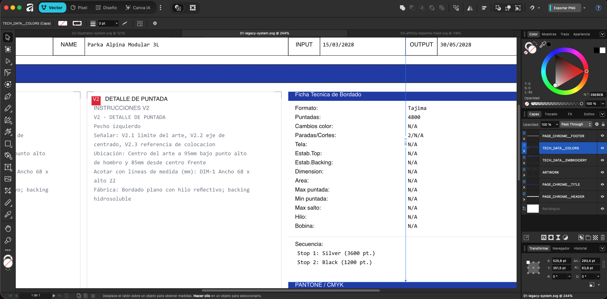
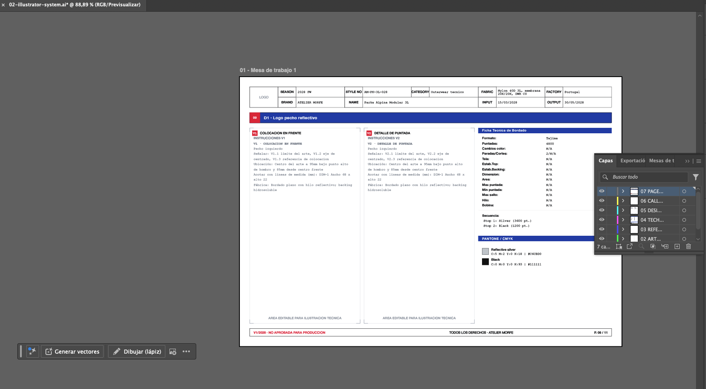
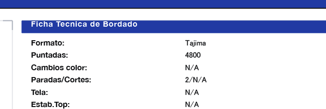
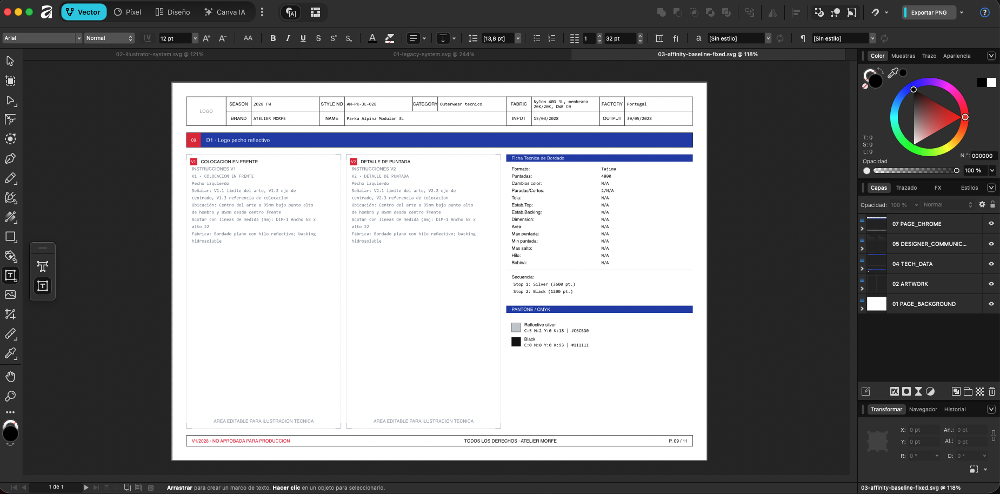
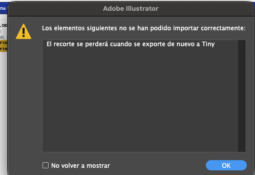
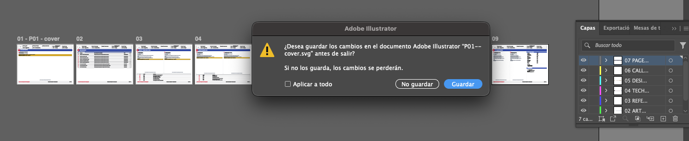
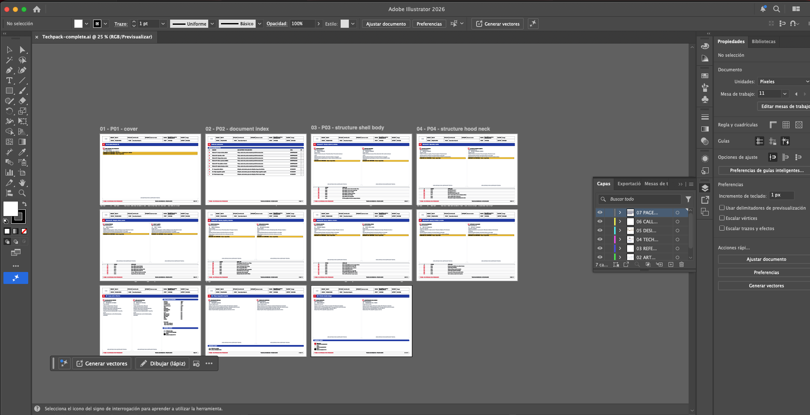
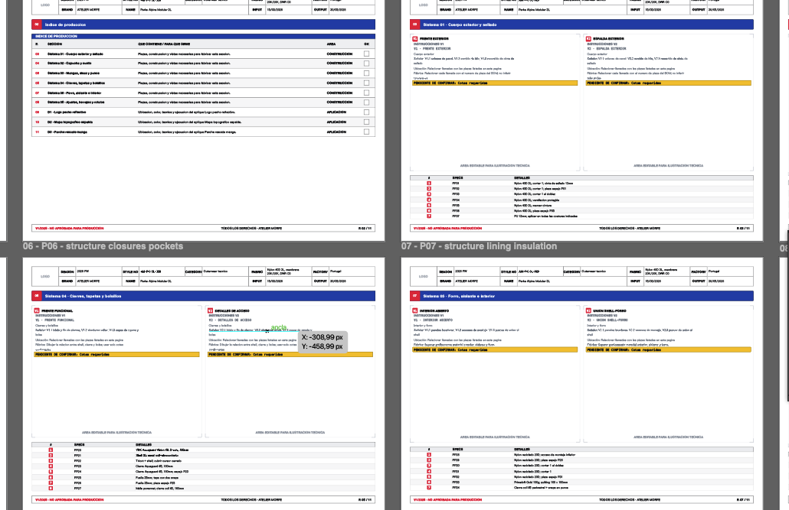
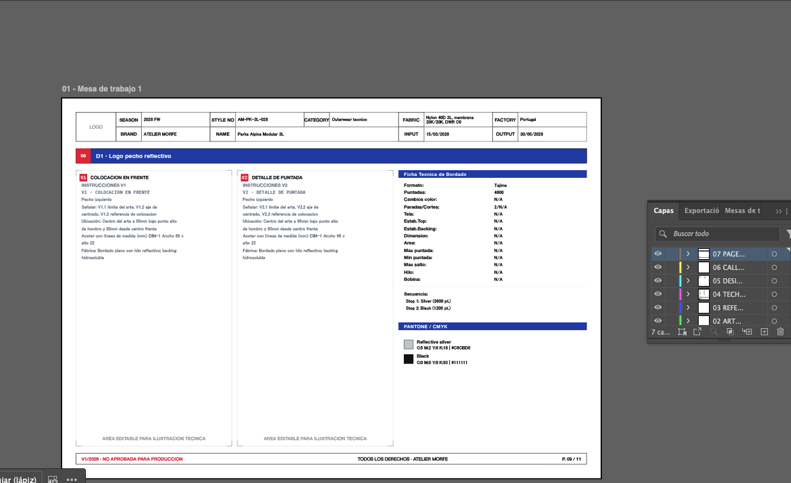

# Prueba controlada de Affinity e Illustrator

Esta carpeta compara la misma pagina real del benchmark `O-complete-semantic-project` con dos contratos de exportacion. No son dos layouts distintos.

## Archivos

- `sample/01-legacy-system.svg`: salida anterior, sin preparacion especifica para Illustrator.
- `sample/02-illustrator-system.svg`: misma pagina con XML explicito, fuentes y tamanos originales, baseline vertical explicito para Affinity/Illustrator, imagenes embebidas con `href` y `xlink:href`, metadata segura y siete grupos de capa estables.
- `sample/Techpack-complete.ai`: documento completo con once mesas de trabajo nombradas y siete capas globales.
- `Techpack-Import-Illustrator.jsx`: promueve los grupos SVG a capas nativas y guarda el AI.
- `sample/illustrator-import-report.txt`: version, artboard, capas, objetos y grupos faltantes detectados por Illustrator.

## Capas esperadas

De arriba hacia abajo en el panel Capas:

1. `07 PAGE_CHROME`
2. `06 CALLOUTS`
3. `05 DESIGNER_COMMUNICATION`
4. `04 TECH_DATA`
5. `03 REFERENCES`
6. `02 ARTWORK`
7. `01 PAGE_BACKGROUND`

`DESIGNER_COMMUNICATION` queda aislada para poder ocultarla o borrarla sin tocar datos de fabrica, dibujos, referencias ni numeracion.

## Como repetir la prueba

1. Ejecutar `npm run illustrator:sample` para regenerar ambos SVG desde el fixture.
2. En Illustrator 2026 elegir `Archivo > Secuencias de comandos > Otra secuencia de comandos`.
3. Abrir `Techpack-Import-Illustrator.jsx`.
4. Abrir `sample/Techpack-complete.ai` y revisar el reporte.
5. Abrir aparte `sample/01-legacy-system.svg` para comparar el comportamiento anterior.

## Proceso y problemas resueltos

### 1. SVG heredado

Affinity conservaba los grupos del SVG, pero cada pagina seguia siendo un
documento independiente. Esta version se mantiene como control: no se modifica
ni se elimina del programa.

### 2. Capas nombradas, pero vacias

Illustrator 30.4 importo los siete contenedores visuales, pero descarto sus
atributos `id`. El primer JSX creo capas con los nombres correctos y dejo los
objetos dentro de `SOURCE_SVG`. El reporte permitio detectar el fallo sin
depender solo de una captura.

La correccion usa el orden de apilado determinista como fallback. Illustrator
ahora crea siete capas nativas y mueve un contenedor de cada pagina a cada capa.

### 3. Metricas tipograficas alteradas

Una primera normalizacion sustituyo las familias originales. Aunque el SVG era
valido, cambio anchos, tamanos aparentes y posiciones. Se retiro toda
sustitucion: las fuentes y tamanos del renderer son la fuente de verdad.

### 4. Baseline inconsistente

Affinity e Illustrator interpretan `dominant-baseline=central` de forma
distinta. El perfil final lo convierte a una linea base explicita: `0.36em`
para texto UI y `0.35em` para datos monoespaciados, sin cambiar cajas ni
columnas.

### 5. Avisos TinySVG y dialogos repetidos

Illustrator mostraba un aviso modal por cada `clipPath`. El renderer ya mide y
envuelve los textos antes de exportar, asi que esos recortes eran redundantes.
El perfil Adobe ahora los elimina sin modificar el contenido visible.

El primer importador multipagina abria cada SVG como un documento separado.
Visualmente funcionaba, pero al cerrar Illustrator aparecia un dialogo de
guardado por cada pagina y no existia un unico archivo maestro.

### 6. Un solo documento con mesas nombradas

El importador se cambio a dos pasadas:

1. Abre cada pagina preparada, identifica sus siete grupos semanticos y copia
   los objetos a grupos de pagina dentro de las capas globales.
2. Crea una mesa A4 por pagina, la nombra y la coloca en una reticula de cuatro
   columnas. Esta reticula evita superar el ancho maximo del lienzo de
   Illustrator con documentos largos.

El resultado es un solo `Techpack-complete.ai`, no once documentos sueltos.
Cada mesa conserva el orden del indice y nombres como `P01 - cover`,
`P02 - document index` y `P09 - design logo chest`.

La inspeccion ampliada confirma que cada pagina mantiene header, artboards,
tablas, briefs, footer y numeracion dentro de sus limites.

### 7. Resultado aceptado

- 11 mesas A4 nombradas y ordenadas en un unico archivo;
- 7 capas globales con 11 grupos de pagina cada una;
- comunicacion del disenador aislada y borrable;
- fuentes, tamanos y espaciado preservados;
- baseline corregido sin desplazar cajas ni columnas;
- sin recortes, sustitucion tipografica ni dialogos bloqueantes;
- apertura verificada en Illustrator 30.4 y Affinity 3.2.3.

## Resumen de decisiones

| Problema | Causa | Solucion integrada |
| --- | --- | --- |
| Capas nombradas pero vacias | Illustrator descartaba los `id` SVG | Fallback por orden de apilado y promocion a capas nativas |
| Texto con tamanos aparentes distintos | Sustitucion de familias durante la preparacion | Conservar familia, peso y tamano del renderer |
| Texto desplazado verticalmente | Interpretacion distinta de `dominant-baseline` | Offset de baseline explicito por tipo de texto |
| Aviso TinySVG repetido | `clipPath` redundante en cada pagina | Retirar clips despues de medir y envolver el contenido |
| Once documentos independientes | Importacion directa pagina por pagina | Ensamblaje en un unico AI con mesas nombradas |
| Limite horizontal del lienzo | Todas las mesas estaban en una sola fila | Reticula determinista de cuatro columnas |

## Capturas necesarias

Tomar las capturas al 100% de zoom y sin modificar el documento:

1. El artboard completo del AI nuevo.
2. Panel Capas con las siete capas desplegadas.
3. Panel Mesas de trabajo y dimensiones del documento.
4. Acercamiento a header, tabla, instrucciones amarillas y footer.
5. El SVG anterior abierto con su panel Capas.
6. Cualquier aviso de fuentes, perfil de color o contenido SVG.

## Criterio de aceptacion

- A4 horizontal: `297 x 210 mm`.
- Ningun texto cortado, sustituido o desplazado.
- Sin imagenes vinculadas ausentes.
- Siete capas nativas con los nombres indicados.
- La capa de comunicacion con el disenador puede ocultarse sin cambiar el documento de fabrica.
- El SVG nuevo y el anterior contienen el mismo contenido; las diferencias deben provenir solo del contrato de importacion.
