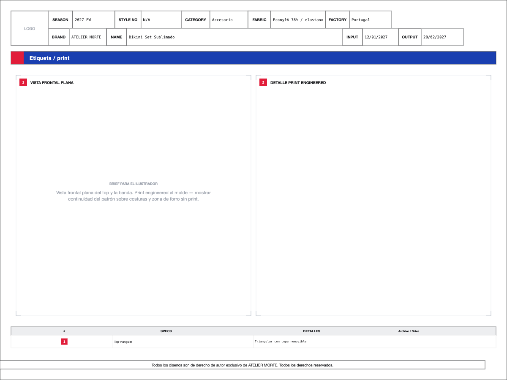
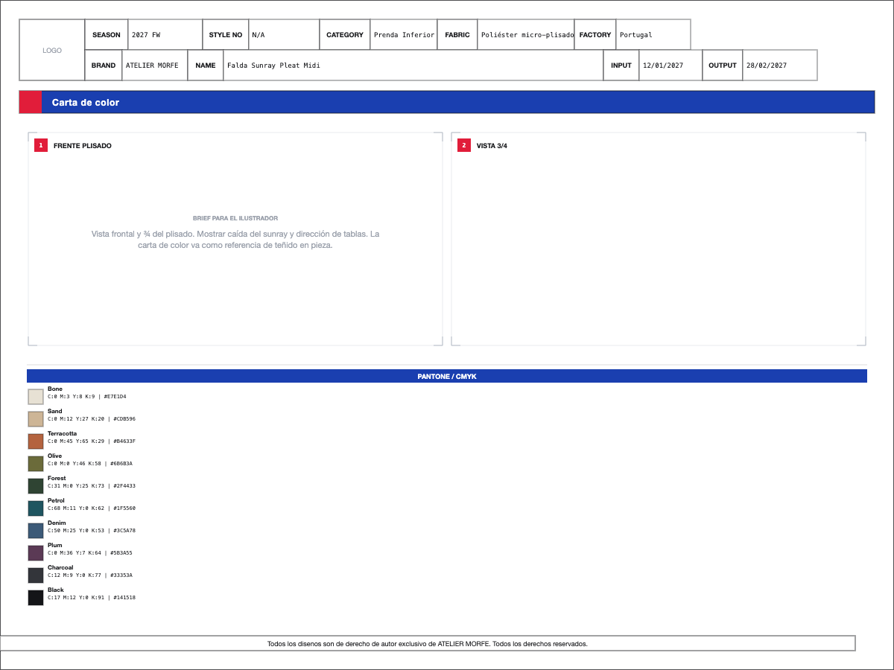
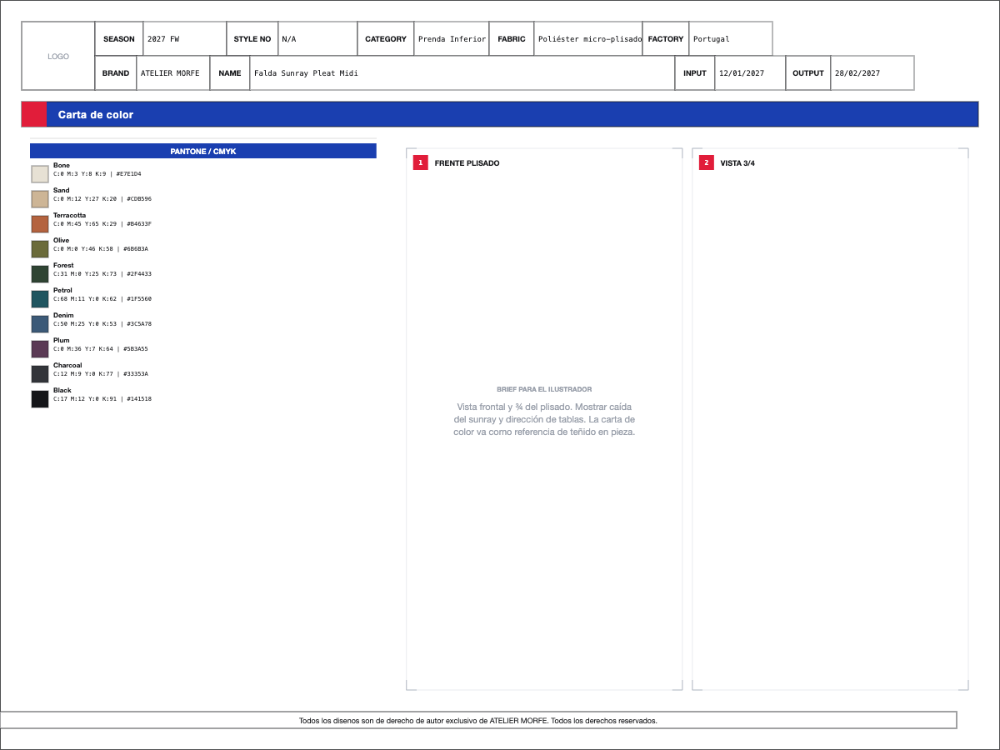
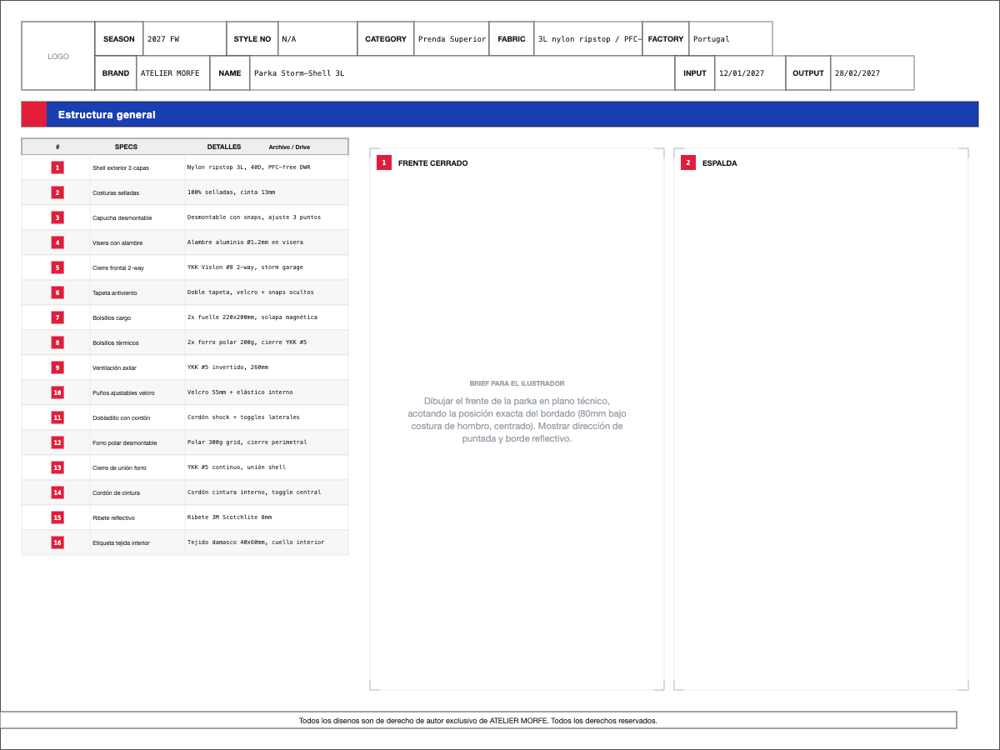
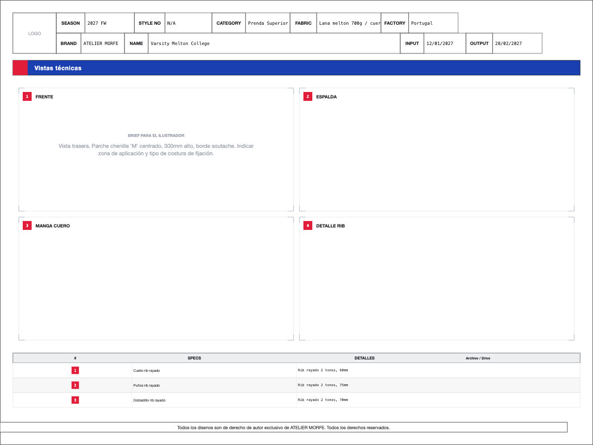
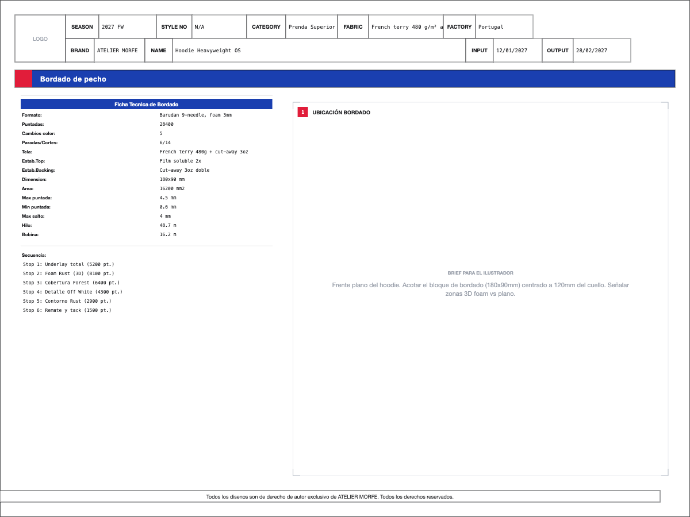
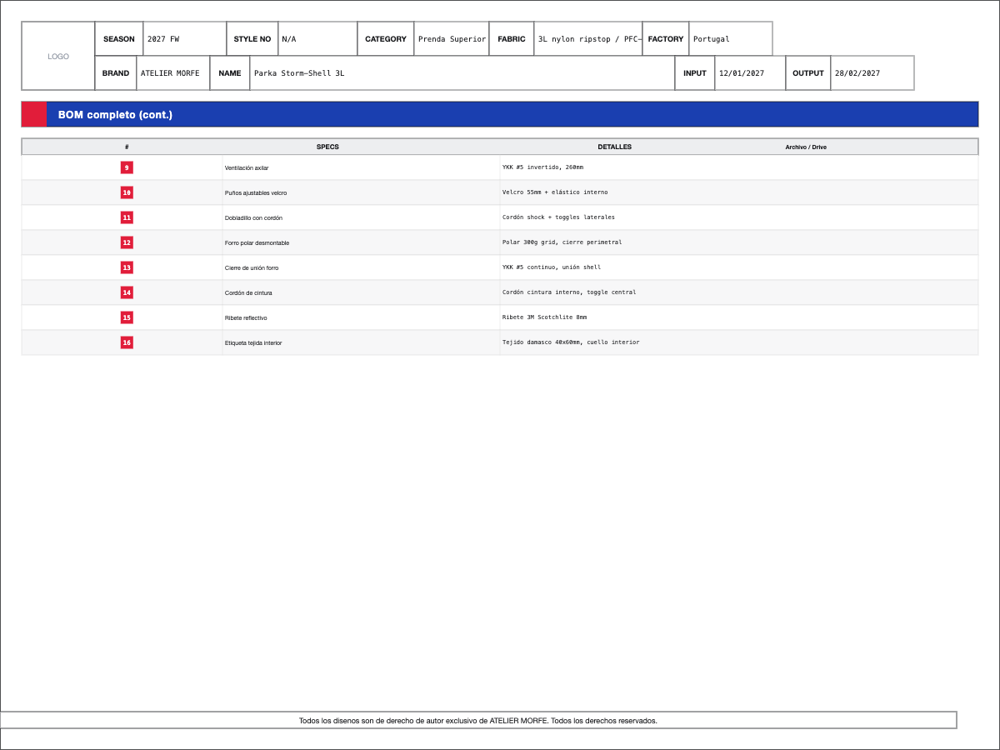

# Layout Lab

A developer-only harness for testing the tech-pack **layout engine and AI planning pipeline** without the six-step wizard or chat. Its Design system tab renders fixed inputs deterministically; its AI plan tab exercises the live planner with contract fallbacks.

> Open it with the dev server running: **`npm run dev`** → [http://localhost:3001/layout-lab.html](http://localhost:3001/layout-lab.html)
> It is **not** part of the production build — `vite build` only bundles `index.html`.

---

## Why this exists

A generated tech-pack page is produced in two independent stages:

1. **The plan** — *which* regions a page has, their weights, and how they compose (e.g. a `split` placing a narrow parts list beside a wide illustration). This is authored by the AI (`documentPlan.js`).
2. **The layout** — *how* those regions resolve into absolute boxes on a 1200×900 artboard, via the deterministic flex solver (`src/layout/solve.js`) and the page interpreter (`src/pages/interpretPlan.js`).

When a page looks wrong, the first question is always: *is it a bad plan, or a bad layout?* You can't answer that while the plan is coming from a live, non-deterministic model that is also subject to network timeouts. So the Lab freezes stage 1 with hand-written **fixtures** and exercises only stage 2. Same inputs, same output, every time.

Both phases of the test plan are available:

| Phase | What's fixed | What's tested | AI / network |
| --- | --- | --- | --- |
| **1 · Design system** | The plan (hand-written fixtures) | Layout, contracts, briefs, review diff | None |
| **2 · Plan + design** | Only the garment datasets | The AI planner **and** the layout | AI planner with deterministic fallback, no wizard/chat |

Phase 2 reuses the exact same garment datasets but lets `planDocumentOutline` + `planPageLayout` generate the plan, so the whole pipeline is exercised while still skipping the questionnaire and the chat.

---

## What's in it

- **`datasets.js`** — 5 complex garments with unique designs, each defining the `ctx` (header, parts, designs) the engine consumes: a technical 3-in-1 parka, an oversized hoodie, a pleated midi skirt, a wool/leather varsity jacket, and a sublimated bikini set.
- **`fixtures.js`** — 23 scenario plans, including dedicated measure-pass, contract-repair, per-slot brief, review-diff, and content-density matrices.
- **`main.js`** — renders every fixture with `buildPlannedPages(...)`, displays deterministic diagnostics, and provides **grayscale** and **grid-overlay** toggles.

---

## The compositor decision this Lab drives

The layout engine evaluates **candidate compositions** rather than applying a
garment template. For the same page intent it measures the actual BOM, colors,
embroidery and notes, then compares row and stack candidates against five
ordered constraints: complete data, legible minimums, purpose-specific
illustration bands, maximum useful illustration area, and minimum unexplained
space. The diagnostic above every fixture records the chosen mode, overflow,
area and calculated column widths.

### Parts list → stacks (good)

A parts-list row is a wide, three-column record (`#` / spec / detail) that reads well stretched to the full page width. A one-row table becomes a clean full-width strip under the illustration, no wasted space:

### Color / embroidery specs → measured like every other block

A color card is the opposite: narrow, left-weighted content (a swatch + one line per color). Stacking it full width doesn't remove the dead space — it just **moves it from below a side column to the right of a wide band**, which looks worse:

| Before — color card stacked full width (dead space at right) | After — color card kept as a side column |
| --- | --- |
|  |  |

There is no type whitelist and no fixed ratio. A short card can become a compact
band when that preserves more useful illustration area; a dense card becomes a
legible side column. Multiple technical blocks can form separate columns, and
any block that exceeds its legible capacity continues on another page. The
pure evaluator lives in `src/pages/composition.js` and is tested independently
from rendering.

---

## Fixture matrix

Compositor decision was verified against the layout tree directly, not by eye.

| Fixture | Garment | Tests | Result |
| --- | --- | --- | --- |
| **A** · split row | Parka (16 parts) | Full parts list beside illustration | **Row** — table fills its column |
| **B** · split stack | Bikini (1 part) | Very short parts list beside illustration | **Stack** — full-width strip below |
| **C** · colorSpecs heavy | Skirt (10 colorways) | Heavy color card beside illustration | **Row** — side column |
| **C2** · colorSpecs short | Skirt (2 colorways) | Short color card | Candidate chosen by measured area, not type |
| **D** · embSpecs heavy | Hoodie | Embroidery sheet beside illustration | **Row** — side column |
| **E** · illustration grid | Varsity (4 views) | 2×2 illustration grid + short parts list | **Stack** — grid on top, strip below |
| **F** · pagination | Parka (16 parts) | Parts list in a short band | **2 pages** — continues 1…16, nothing dropped |
| **G** · note block | Bikini | Note band + full-width illustration | No split — note over illustration |
| **H** · full document | Varsity | 4-page doc (overview + 3 designs) | Coherent; each design uses its own data |
| **I** · measure pass | Bikini | Bounded one-row BOM + absorber | Compact strip; illustration receives slack |
| **J** · contract repair | Hoodie | Invalid design page | Forbidden BOM dropped; mandatory regions inserted |
| **K** · per-slot briefs | Parka | Two distinct structured briefs | Each art board carries its own instructions |
| **L** · review diff | Varsity | Three omitted design pages | Every omission appears in diagnostics |
| **M** · BOM density | Same overview, 1/6/16/24 rows | Decision under changing data only | Stack → row → continuation as needed |
| **N** · design density | Same design, 1/3/10 colors and 0/6/30 stops | Multiple technical columns | Complete rows with dynamic widths |

A few of the results rendered:

| A · row (parts list fills column) | E · 2×2 illustration grid + short strip |
| --- | --- |
|  |  |

| D · embroidery sheet as side column | F · paginated BOM (page 2 of 2) |
| --- | --- |
|  |  |

---

## AI-plan tab (Phase 2)

The **AI plan** tab runs the real pipeline — `planDocumentOutline` +
`planPageLayout` + the page contracts — against a chosen dataset through the
dev proxy, so the whole plan → contract → render path can be watched end to
end without the six-step wizard. Pick a garment, hit **Plan with AI**, and the
log shows each outline and per-page call, whether the contract validated
clean after repair, and the rendered pages as they arrive. (Needs `npm run
dev` and the local proxy. If DeepSeek times out or reports exhausted capacity,
the log identifies the failure and renders the deterministic contract fallback
instead of leaving the Lab stalled.)

The **Grid** toggle overlays the shared `COL` column template (blue dashed
guides) and a whole-pixel baseline, so P1 alignment can be checked against the
exact metrics every renderer now shares.

See [../layout-contracts.md](../layout-contracts.md) for the full architecture
behind these tabs.

## Adding a scenario

1. Add or extend a garment in `datasets.js` (it only needs `hdr`, `parts`, `designs`, `garment.partLabels`).
2. Add a fixture in `fixtures.js` with a `plan` (pages → regions, using the closed vocabulary in `interpretPlan.js`: `header, titleBar, illustration, partsList, colorSpecs, embSpecs, note, spacer, disclaimer`, plus the `split` composite) and fill in `tests` / `expected`.
3. Reload the Lab — Vite HMR picks it up live.
